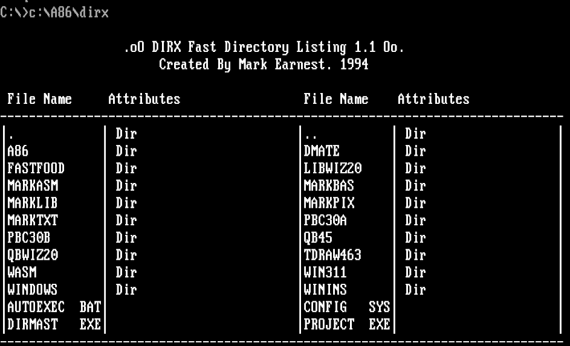

# dirx

Fast directory listing for DOS.
Written because on very old computers, the DOS dir command would take a very long time to return on large directories. In addition, it displays file attributes by default and supports pagination.

## Building

This is designed to compile using using the A86 Macro Assembler V3.22 by Eric Isaacson.

```dos
C:>a86 dirx.asm dirx.com
```


